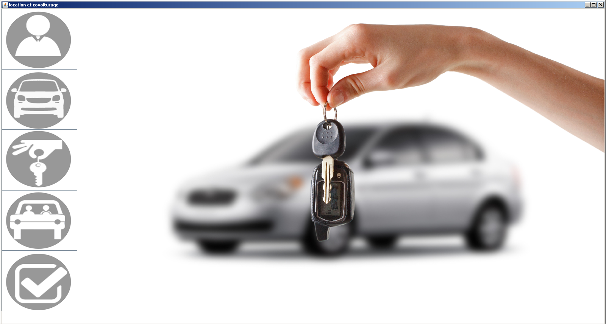
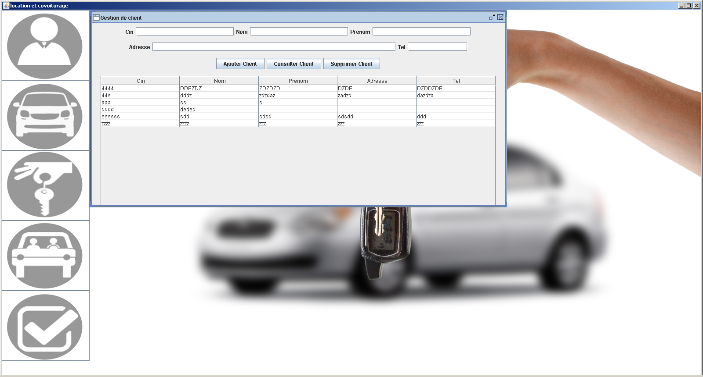
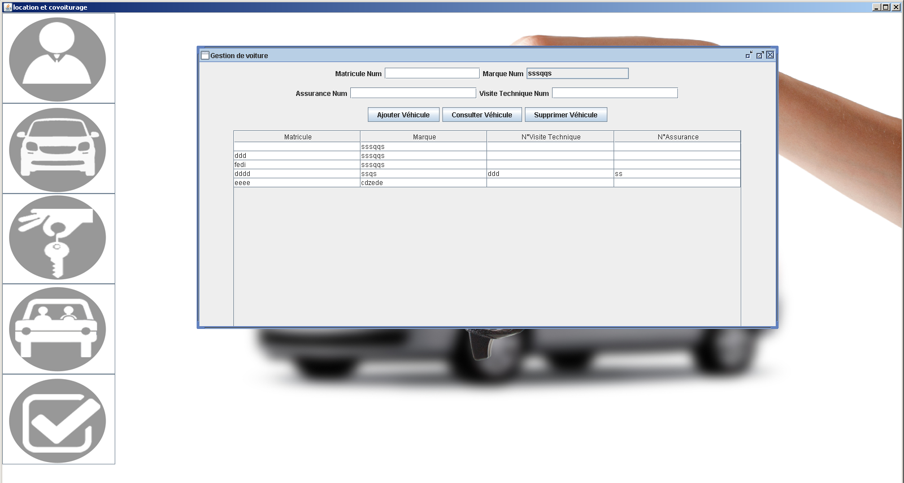
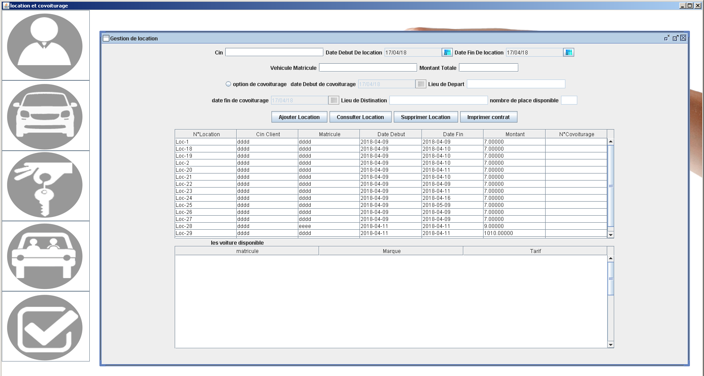
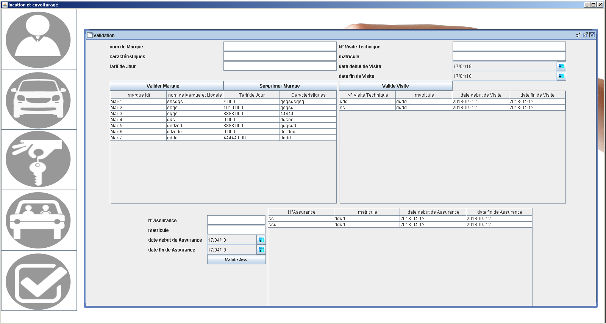
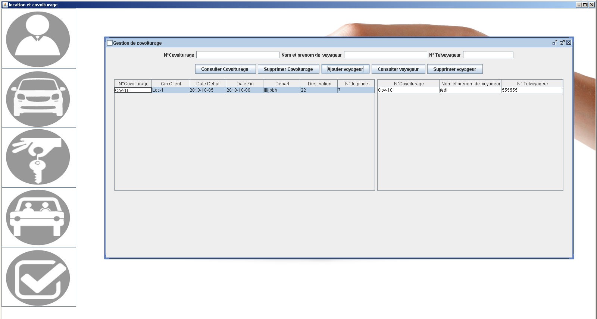

#  Application de gestion de location de voitures multi-documents  
Une application multi-documents est une application pouvant avoir plusieurs fenêtres incluses dans une fenêtre principale : 

# Les technologies utilisées : java , swing(JDesktopPane,JInternalFrame,...) ,MySQL
 

 
### Gestion des clients
###### Fiches clients, historique des réservations, total recettes, liste noire...

### Gestion des véhicules
###### Historique des réservations, total recettes et dépenses, alertes des assurances, vidanges...

### Gestion des réservations
###### Planning mensuel, suivi de paiements, dossiers longues durée, liste des impayés...

### Covoiturage 

